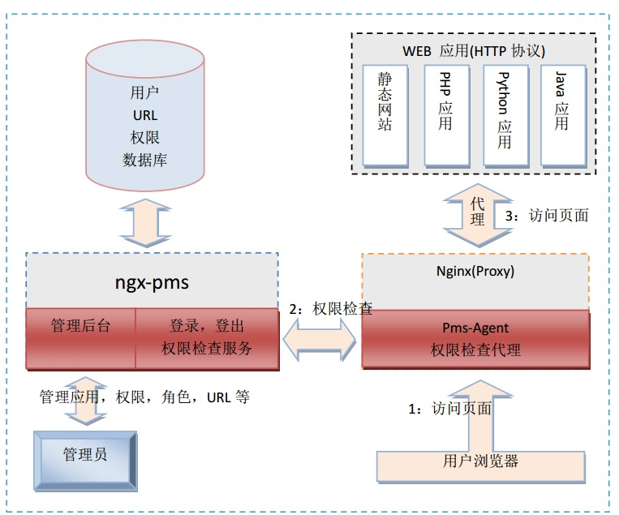

# 应用范围
&nbsp;&nbsp;&nbsp;&nbsp;每一个公司内部都有各种后台系统，管理系统。通常每个系统都会有相应的帐号系统，权限管理模块。造成浪费，并且不统一造成管理复杂。

&nbsp;&nbsp;&nbsp;&nbsp;本系统可应用于各种平台，各种系统之上，能统一管理帐号，权限等问题。避免各个系统都需要开发一套帐号系统及权限管理系统。

# 特点
* 语言无关，只要是HTTP程序都能使用，包括但不限于：纯静态网页，JSP,PHP,ASP, PYTHON,CGI等WEB系统。
* 自带管理后台，可对应用，帐号，权限，角色及URL进行管理。
* 可同时管理多套应用的权限，不同的应用权限完全分开管理。
* URL匹配支持精确匹配，后缀匹配，前缀匹配三种模式。

# 实现：
* 采用纯Lua实现
* 基于nginx(ngx_lua)
* 管理后台界面采用DWZ(http://www.j-ui.com/)
* 数据库采用MYSQL.

# 架构图

# 对象关系脑图

# 部署
* 部署请参见[部署文档](docs/deploy.md)
