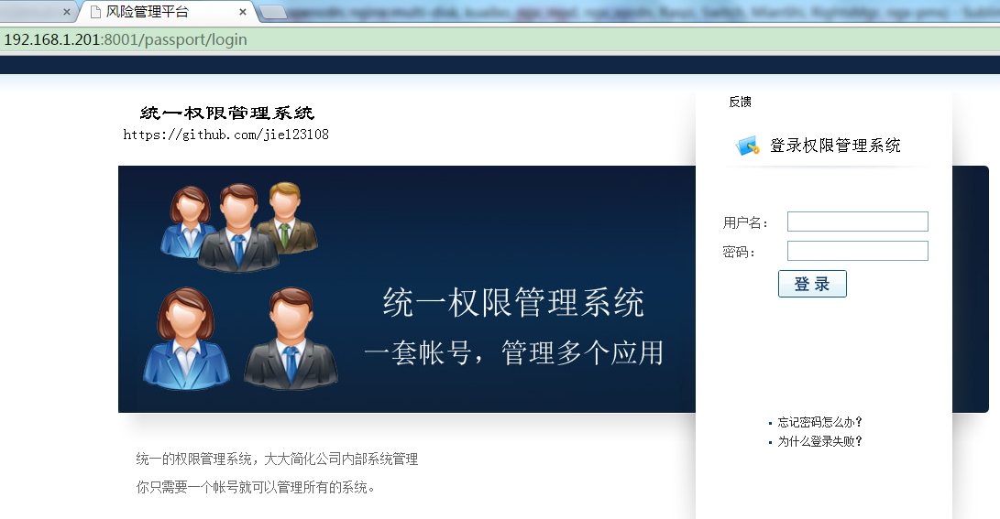
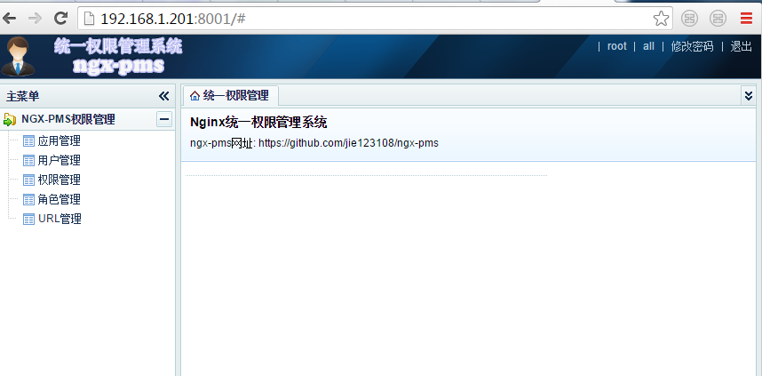

#先决条件 
* 安装MYSQL
* 安装OpenResty

# 目录
* [安装](#安装)
    * [数据库初始化](#数据库初始化)
    * [服务部署](#服务部署)
    * [添加根帐号](#添加根帐号)
* [使用管理后台](#使用管理后台)
* [部署权限代理](#部署权限代理)
* [访问应用并登录](#访问应用并登录)
* [百度百科配置示例](demo_baike/README.md)

# 安装
-------
#### 数据库初始化
* 先创建数据库，`进入mysql命令行，执行以下命令：`

```shell
create database pms character set utf8;
use pms;
```

* 执行脚本创建表结构：

```shell
source /path/to/ngx-pms/docs/scripts/db.sql
```
如果执行成功，应该创建了如下几张表：
```mysql
mysql> show tables;
+-----------------+
| Tables_in_pms   |
+-----------------+
| application     |
| permission      |
| role            |
| url_perm        |
| user            |
| user_permission |
+-----------------+
6 rows in set (0.00 sec)
```

#### 服务部署
* nginx.conf配置(可直接使用ngx-pms/conf/nginx.conf,并修改其中文件路径)

```nginx
    #保存cookie信息的共享内存。
    lua_shared_dict cookies 5m;
    #其它信息的缓存
    lua_shared_dict cache 2m;
    # 文件路径包含，分别是：项目，依赖库，及manager的文件。
    lua_package_path "/path/to/ngx-pms/lua/?.lua;/path/to/ngx-pms/libs/?.lua;/path/to/ngx-pms/manager/lua/?.lua;;";

    # ngx-pms授权接口
    server {
        listen 8000;
        set $template_root /path/to/ngx-pms/tmpl;

        location /pms/ {
            content_by_lua_file /path/to/ngx-pms/lua/server/pms_main.lua;
        }
    }

    # ngx-pms管理后台。
    server {
        listen 8001;
        set $template_root /path/to/ngx-pms/manager/templates;

        location / {
            content_by_lua_file /path/to/ngx-pms/manager/lua/man_main.lua;
            log_by_lua_file /path/to/ngx-pms/manager/lua/clean_cache.lua;
        }

        location /static {
            root /path/to/ngx-pms/manager;
        }

        location = /password {
            allow 127.0.0.1;
            deny all;
            content_by_lua '
                local util = require("util.util")
                ngx.say(util.make_pwd(ngx.var.arg_password))
            ';
        }
    }
```

* config.lua配置

```lua
-- 上面部分省略。

-- Cookie 设置相关参数。
_M.cookie_config = {key="pms", path="/", expires=3600}

-- 数据库配置。
_M.db = {host="127.0.0.1", port=3306,user="root", password="123456",
		database="pms",DEFAULT_CHARSET="utf8"}

-- 列表显示时，默认分页大小
_M.defNumPerPage = 15

-- Password加密使用的盐，在系统使用之前修改，系统开始使用后，请不要修改。
_M.password_magic = '#*pms@0Ol1llOO'
```
主要需要修改_M.db中的数据库部分。
系统初始化时，需要修改_M.password_magic部分。

* 启动nginx
```
nginx -c /path/to/ngx-pms/conf/nginx.conf 
```

nginx启动后，就可以访问管理后台来对系统进行管理了，但由于还没有帐号，无法登录，请按照下面的步骤生成密码，并添加root帐号：

#### 添加根帐号
* 在部署的服务器上，使用下面的命令生成加密的密码：<br/>
`curl http://127.0.0.1:8001/password?password=password-of-root`<br/>
如果执行成功，会返回一个40位的密码，类似：`32a8fbbe6412045fb333bcfe1785adff`<br/>
如果出错，请查看错误日志，来下定位问题所在。
* 使用该生成的密码替换下面的${password}，然后在数据库中执行：<br/>
模版为：

```sql
insert into user(username,email,tel,password,app,manager, role_id,create_time, update_time)
values('root', 'jie123108@163.com', '13380333333', '${password}',
'all', 'super', '',unix_timestamp(), unix_timestamp());
```

替换后为（请不要使用本示例中的sql）：

```sql
insert into user(username,email,tel,password,app,manager, role_id,create_time, update_time)
values('root', 'jie123108@163.com', '13380333333', '32a8fbbe6412045fb333bcfe1785adff',
'all', 'super', '',unix_timestamp(), unix_timestamp());
```

* 添加好帐号后,就可以访问管理后台，对整个系统进行管理了。

# 使用管理后台
--------
* 访问刚才部署的管理后台服务 `http://192.168.1.xx:8001/`
 
* 输入root及你设置的密码，就可以登录成功了。进去后，界面大致如下：
 
* 点击相应的菜单，就能进行相应的管理了。

# 部署权限代理
--------------
权限代理（pms-agent）是需要部署在要管理的应用的反向代理nginx上面：

#### nginx.conf配置(可参考ngx-pms/conf/pms-agent.conf,并修改其中文件路径)
```nginx
    #保存cookie信息的共享内存。
    lua_shared_dict cookies 5m;
    #其它信息的缓存
    lua_shared_dict cache 2m;
    # 文件路径包含，分别是：项目，依赖库，及manager的文件。
    lua_package_path "/path/to/ngx-pms/lua/?.lua;/path/to/ngx-pms/libs/?.lua;/path/to/ngx-pms/manager/lua/?.lua;;";

    # pms-agent权限代理(可以与“pms授权接口”部署在一个nginx上，也可以分开部署)
    # 示例配置(www.w3school.com.cn)
    server {
        listen       80 default;
        listen       1200 default;
        server_name www.w3school.com.cn;

        # 以/pms开头的请求，需要代理到“pms授权接口”
        location /pms {
            proxy_set_header Host $host;
            proxy_set_header X-Real-IP $remote_addr;
            proxy_set_header REMOTE-HOST $remote_addr;
            proxy_set_header X-Forwarded-For $proxy_add_x_forwarded_for;
            proxy_set_header Accept-Encoding "";
            client_max_body_size 5m;
            client_body_buffer_size 256k;
            proxy_connect_timeout 10;
            proxy_send_timeout 10;
            proxy_read_timeout 10;
            proxy_buffer_size 256k;
            proxy_buffers 4 256k;
            proxy_busy_buffers_size 256k;
            proxy_temp_file_write_size 256k;
            proxy_max_temp_file_size 128m;
            # 这里要写“pms授权接口”的地址。
            proxy_pass    http://127.0.0.1:8000;
        }
        # 清除响应体大小。
        header_filter_by_lua ' ngx.header.content_length = nil '; 
        # 过滤器，在相应页面，加上信息条。
        body_filter_by_lua_file /path/to/ngx-pms/lua/agent/body_filter.lua;
        
        # 应用的反向代理设置。
        location / {
            # $app变量的值，必须是已经在管理后台上已经添加成功的应用ID.
            set $app w3school;
            # 权限检查的脚本。
            access_by_lua_file /path/to/ngx-pms/lua/agent/permission_check.lua;

            proxy_set_header Host www.w3school.com.cn;
            proxy_set_header X-Real-IP $remote_addr;
            proxy_set_header REMOTE-HOST $remote_addr;
            proxy_set_header X-Forwarded-For $proxy_add_x_forwarded_for;
            proxy_set_header Accept-Encoding "";
            client_max_body_size 5m;
            client_body_buffer_size 256k;
            proxy_connect_timeout 10;
            proxy_send_timeout 10;
            proxy_read_timeout 10;
            proxy_buffer_size 256k;
            proxy_buffers 4 256k;
            proxy_busy_buffers_size 256k;
            proxy_temp_file_write_size 256k;
            proxy_max_temp_file_size 128m;
            # 应用的实际地址。
            proxy_pass    http://www.w3school.com.cn;
        }
    }
```

# 访问应用并登录
------
访问应用后，会提示登录，你使用在管理后台中添加的用户帐号登录，就可以访问相应具有权限的页面了。
